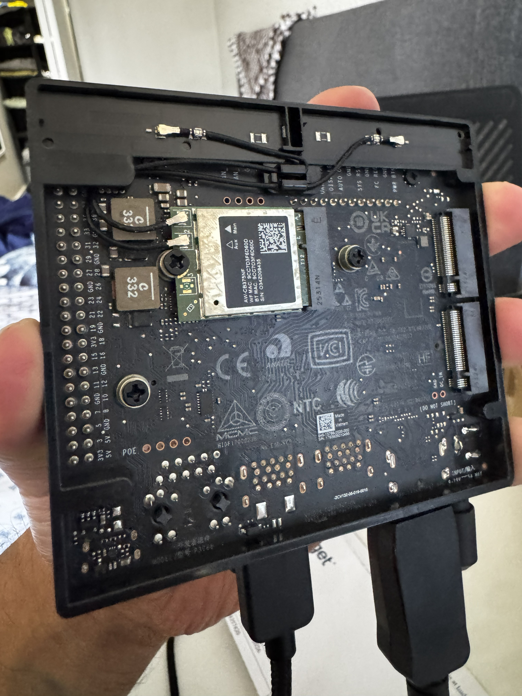
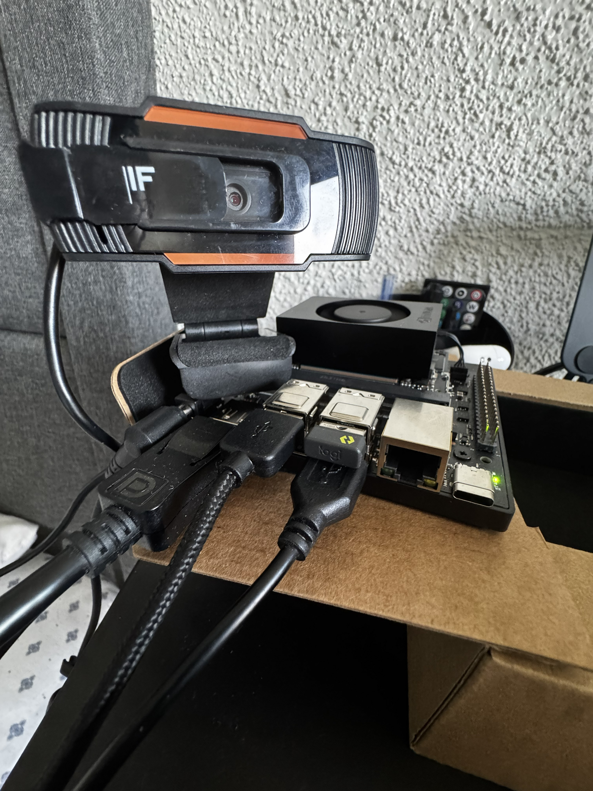
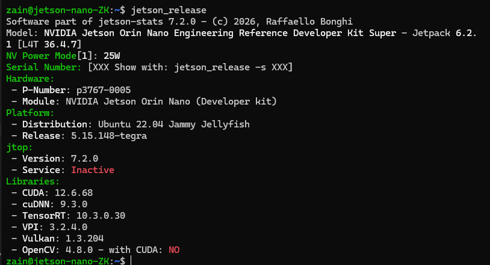
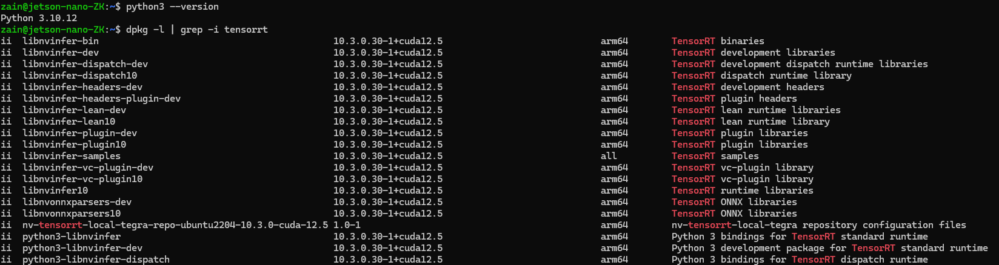
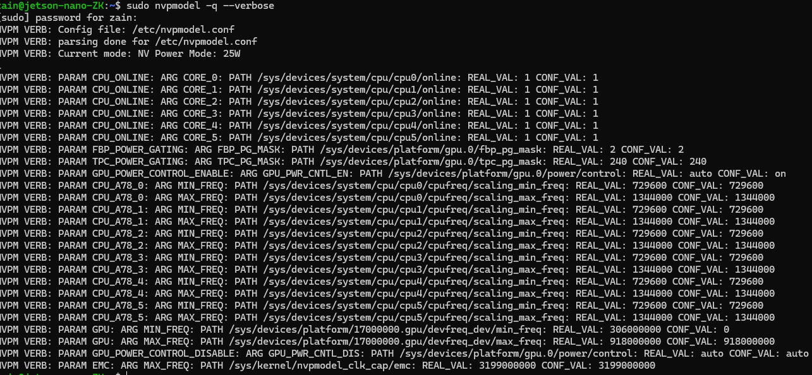
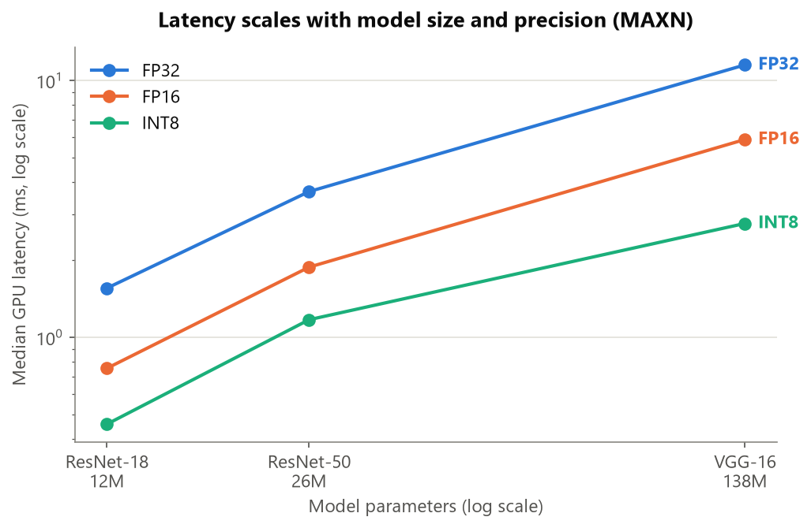
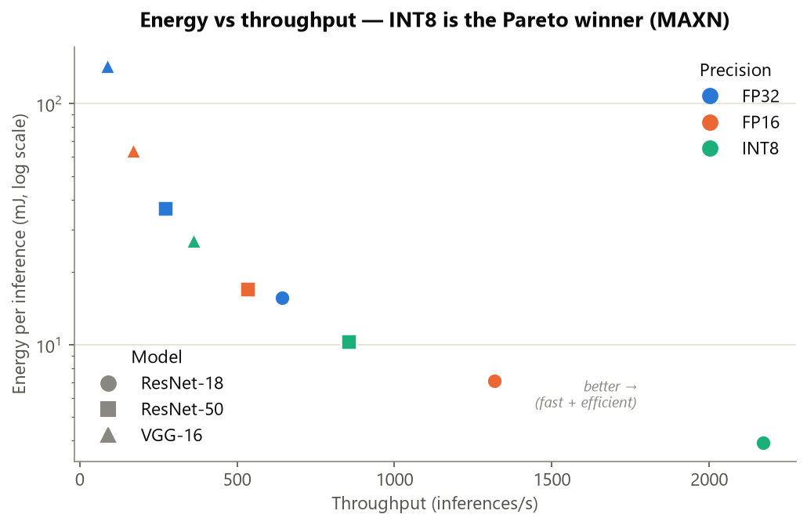
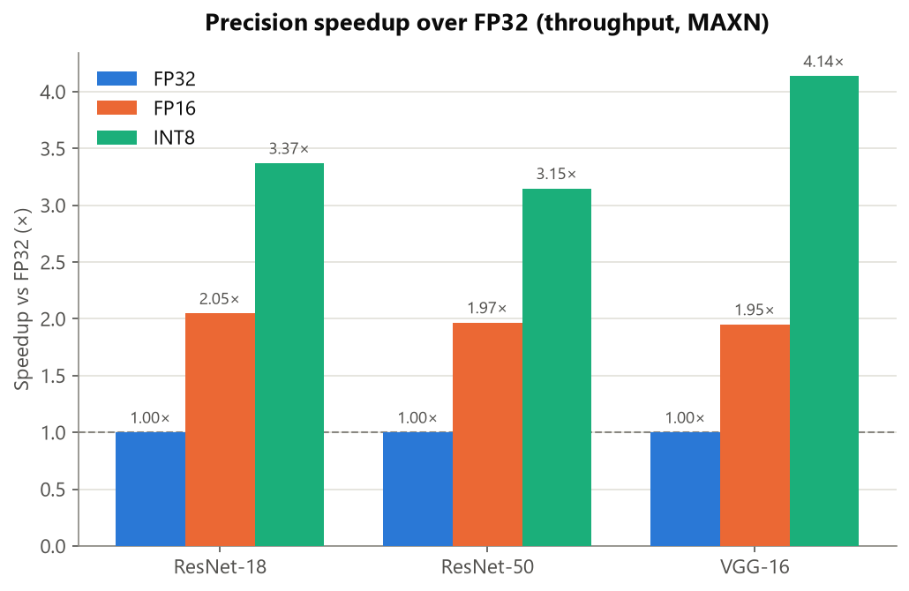
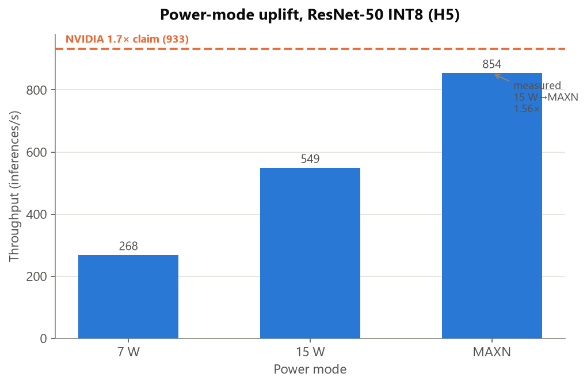

# Benchmarking Real-Time Object Recognition on the NVIDIA Jetson Orin Nano (Super) Developer Kit: The Effect of Model Architecture, Numerical Precision, and Power Mode — Including the "Super" Uplift — on Latency, Throughput, and Energy Efficiency

**Author(s):** Zain Khan  
**Affiliation / Course:** Self-Directed Learning  
**Date:** 07/20/2026  
**Device under test:** NVIDIA Jetson Orin Nano 8GB (Super) Developer Kit — ASIN B0BZJTQ5YP

---

## Abstract

This study benchmarks real-time object recognition on the NVIDIA Jetson Orin Nano 8GB "Super" developer kit and asks a deployment-focused question: **given a fixed, constrained input sensor, what is the minimum-cost configuration (model × precision × power mode) that still meets the real-time target?** A compute microbenchmark (Experiment A) first maps the trade-off surface — on the Ampere Tensor Cores, FP16 roughly doubles throughput over FP32 and INT8 adds a further 1.6–2.1× (3–4× over FP32), and *when the GPU is compute-bound*, MAXN "Super" is the **most** energy-efficient mode because it finishes each inference fastest ("race-to-idle"). A deployment experiment (Experiment B) then runs the detection pipeline on a fixed 30 fps USB camera and finds that **every detector tested (SSD-Mobilenet-v2, YOLOv8n/s) infers 5–8× faster than the camera can deliver frames** — the sensor, not the GPU, bounds real-time throughput, leaving the accelerator idle ~¾ of the time. This reframes the design goal from *"how fast can it go?"* to *"what is the least power and cost needed to meet a fixed requirement?"* and motivates the central synthesis: identifying the energy-optimal configuration under the sensor constraint, and testing whether the optimal power mode **inverts** relative to the compute-bound case. *(The optimal-configuration synthesis — the detection power-mode sweep and the accuracy comparison — is developed in §6.2 and §7.)*

**Keywords:** edge AI, embedded inference, Jetson Orin Nano, Ampere, Tensor Cores, TensorRT, INT8 quantization, object detection, benchmarking, energy efficiency

---

## 1. Introduction

### 1.1 Motivation
Object recognition on embedded devices underpins applications such as [e.g., robotics, wildlife camera traps, smart cameras, assistive tech]. Unlike a datacenter GPU, an edge device must satisfy hard constraints on power, thermals, and memory. Choosing a model is therefore not just an accuracy decision — it is a joint optimization over accuracy, latency, energy, and memory. The Orin Nano is notable for being powerful enough to run "all modern AI models" (including transformer-based detectors) while still living in a single-digit-to-~25 W envelope, which makes the precision and power-mode knobs studied here consequential rather than academic.

Crucially, a real edge system is often bounded not by its accelerator but by a cheaper, slower component — here, the USB camera. When that happens, the design goal shifts from *maximizing* compute to spending the **minimum** power and cost needed to meet a fixed requirement. **Over-provisioning a capable accelerator that the rest of the system cannot keep fed is an efficiency failure, not a feature** — burning watts (and heat, and battery, and hardware cost) to exceed a ceiling the sensor makes unusable. This study therefore treats the constrained sensor not as a nuisance but as the *premise*: it fixes the requirement, and the engineering question becomes finding the leanest configuration that satisfies it.


### 1.2 Problem statement
Given a fixed edge platform (Jetson Orin Nano 8GB Super) and a fixed sensor (USB camera), *how should one select a model and runtime configuration to meet a real-time throughput target at minimal energy cost, and what accuracy is sacrificed to do so?*

### 1.3 Research questions
- **RQ1 (Architecture):** How do latency, throughput, memory, and energy scale with model complexity (parameters / FLOPs) on the Orin Nano?
- **RQ2 (Precision):** What is the latency/throughput/accuracy trade-off of FP16 and INT8 versus FP32 *on Ampere Tensor-Core hardware*?
- **RQ3 (Power mode / "Super"):** How much throughput is gained moving 7 W → 15 W → MAXN "Super," and at what power/thermal cost? Does the measured uplift match NVIDIA's ~1.7× claim?
- **RQ4 (Deployment):** In the full camera→infer→render pipeline, how much of the achievable compute throughput is actually realized, and where is the bottleneck?
- **RQ5 (Optimal config under a fixed constraint — the synthesis):** Given that real-time throughput is capped by the sensor (a 30 fps USB camera), what is the **minimum-cost configuration** (model × precision × power mode) that still meets the 30 fps and accuracy targets — and does the **energy-optimal power mode invert** relative to the compute-bound case (RQ3)?

### 1.4 Hypotheses

- **H1:** FP16 will reduce inference latency versus FP32 by roughly [30]% with negligible (<[0.5 mAP] point) accuracy loss, because the Ampere Tensor Cores natively accelerate FP16.
- **H2:** INT8 will provide a *substantial further* speedup over FP16 (predicted [30]%), because the Orin's third-generation Tensor Cores natively accelerate INT8 — INT8 throughput is the basis of the board's 40/67-TOPS rating.
- **H3:** Latency will grow monotonically with model FLOPs, but energy-per-inference will grow *super-linearly* once thermal throttling engages.
- **H4:** End-to-end camera FPS will be lower than compute-only FPS, and for lightweight models the bottleneck will be [capture] rather than inference [due to using a limited USB camera].
- **H5 (the "Super" test):** The MAXN "Super" power mode will deliver close to NVIDIA's claimed ~1.7× throughput uplift versus the 15 W mode, at a cost of ~[10] W extra draw and [10] °C higher temperature.
- **H6 (the constraint inversion — the synthesis):** Because every detector has large compute headroom over the 30 fps camera ceiling, the **lowest** power mode will still meet the target, making it the **energy-optimal** choice — *inverting* H3/H5, where MAXN was most efficient (race-to-idle) because the GPU was compute-bound. Under the sensor constraint, running MAXN will spend extra power for **no** throughput gain, so the optimal config will favor the leanest viable mode.

### 1.5 Contributions
1. A reproducible dual benchmark (compute microbenchmark + end-to-end pipeline) for the Jetson Orin Nano 8GB Super.
2. A quantified architecture × precision × power-mode trade-off surface for Ampere edge hardware.
3. An empirical measurement of the INT8 Tensor-Core speedup and of the "Super" MAXN uplift versus NVIDIA's headline claim.
4. **A deployment synthesis under a real constraint:** identifying the energy-optimal configuration when a fixed 30 fps sensor — not the GPU — bounds throughput, and testing whether the optimal power mode *inverts* relative to the compute-bound regime (the "don't over-provision" result).
5. An open harness and raw dataset (Appendices B–C).

---

## 2. Background

### 2.1 The Jetson Orin Nano platform
The Jetson Orin Nano 8GB integrates a 6-core ARM Cortex-A78AE CPU and a 1024-core **Ampere** GPU with **32 third-generation Tensor Cores** on a shared-memory SoC, with 8 GB of 128-bit LPDDR5. The "Super" configuration raises rated INT8 performance to ~67 TOPS.:



| Property | Value (fill / confirm from your device) |
|---|---|
| Kit | Jetson Orin Nano 8GB Super Developer Kit |
| Module part number | 945-137766-0000-000 (confirm on box) |
| GPU architecture / compute capability | Ampere / SM 8.7 |
| CUDA cores / Tensor Cores | 1024 / 32 (3rd gen) |
| DLA cores | **None** on Orin Nano (DLA exists only on Orin NX / AGX Orin) |
| CPU | 6-core Cortex-A78AE |
| Total shared RAM | 8 GB 128-bit LPDDR5 |
| Memory bandwidth | 68 GB/s (base) → **102 GB/s (Super)** |
| Rated AI perf (INT8) | 40 TOPS (base) → **67 TOPS (Super)** — a claimed 1.7× |
| Carrier board I/O | 2× MIPI CSI (4-lane), 4× USB 3.2 Type-A, DisplayPort, Gigabit Ethernet, M.2 (NVMe + Wi-Fi) |
| Storage (microSD) | [jetson-orin-nano-devkit-super-SD-image_JP6.2.1](https://developer.nvidia.com/embedded/jetpack-sdk-62) kit boots from microSD or an NVMe SSD in the M.2 Key-M slot |
| Cooling | Stock active heatsink + fan included with the kit — confirm: [Y] |
| Ambient temperature during tests (°C) | 21 (room air, external thermometer at fan intake) |

> **Note on JetPack:** the Orin Nano runs **JetPack 5.x or 6.x** (Ubuntu 20.04/22.04, Python 3.8/3.10, CUDA 12.x, TensorRT 8.6/10.x). The **"Super" 67-TOPS mode is a firmware/power-mode unlock, not new silicon** — it requires **JetPack 6.1 (rev 1) or newer (6.2)**, which adds the high-clock MAXN power mode. On earlier JetPack the same board runs at lower clocks and delivers the original 40 TOPS. Per NVIDIA's documentation the MAXN "Super" mode is **`nvpmodel` mode 2** on this kit — but confirm with `nvpmodel -q --verbose` in §4.2, since IDs can shift between JetPack releases. Whether "Super" is available at all depends on your JetPack version, and confirming it is part of the experiment.

### 2.2 Image classification vs. object detection
*Classification* assigns one label to a whole frame (metric: top-1/top-5 accuracy). *Detection* localizes and labels multiple objects (metric: mean Average Precision, mAP). We use classification for a clean architecture-scaling study (Experiment A) and detection for the realistic camera pipeline (Experiment B). On the Orin Nano, small classifiers run so fast that they mainly stress the *pipeline*, which is itself an interesting finding (H4).

> Z - We assess the loss in terms of **mAP** (mean Average Precision) which takes both 'detection', identifying that an object exists in the given frame, and 'classification', identifying what that object is contextually, into account.

### 2.3 Numerical precision, Tensor Cores, and TensorRT
TensorRT compiles a network into an optimized "engine" for a target precision. On Ampere, the Tensor Cores accelerate FP16, BF16, and **INT8**, and support **structured (2:4) sparsity** for a further potential speedup. FP32 is the reference; FP16 roughly doubles Tensor-Core throughput; INT8 requires per-tensor calibration but, unlike on older Maxwell/Pascal edge parts, is *hardware-accelerated here* and is expected to be the fastest precision. In your own words, define what quantization does and why it can change accuracy:

> Z - Running models on a 'coarser' representation of the model's calculated output (ex. from FP32 -> FP16 -> INT8) allows us to run the models faster, as we are not as bottlenecked by the flows required for memory management, however reduces the precision/accuracy, as we use 'less' than we possibly should to represent the output. Finding the optimal balance here - in addition to the other software/hardware constraints, requires testing. 


### 2.4 Power modes and the "Super" uplift
`nvpmodel` selects a power/clock budget; the Orin Nano 8GB Super exposes low-wattage modes (**7 W** and **15 W**) plus, on JetPack 6.1+, the **MAXN "Super"** mode (up to **25 W**, `nvpmodel` mode 2) that simultaneously raises GPU, CPU, *and* memory clocks — the memory-bandwidth jump from 68 to 102 GB/s is a large part of why the headline 67-TOPS/1.7× figure materializes. `jetson_clocks` additionally locks clocks to their maximum for the selected mode. Explain the expected mechanism in one or two sentences:

> Z - nvpmodel applies the software ceiling limits to the CPU/GPU/memory clock, limiting the power/clock envelope and the jetson_clocks locks the clocks to those ceiling values. The idle temp increases as the clock runs at a stable high performance rate, however the stability allows us to test for benchmarks sake.


---

## 4. Materials

### 4.1 Hardware
| Item | Detail (fill in) |
|---|---|
| Board | Jetson Orin Nano 8GB Super Dev Kit |
| Power supply | [5V DC Barrel - 9V / 2.37A (45W) Power Adapter]  |
| Storage | [microSD] |
| USB camera | Model: **"GENERAL WEBCAM"** (generic unbranded USB webcam, on `/dev/video0`); formats: **MJPG** (≤1920×1080) + **YUYV** (≤1280×720); **max 30 fps at every resolution — hard capture ceiling**; test capture res: 1280×720 MJPG. Full format list: `data/env/v4l2_formats.txt`. |
| Cooling | [built-in fan] |
| Host PC (for ONNX export, optional) | [Surface Pro 11] |



> ⚠️ **Power caveat:** an undersized supply can brown out under MAXN "Super" and silently corrupt results. Use a supply with headroom above the mode's rated draw, and record it — it is a confound.

### 4.2 Software

```bash
# L4T / JetPack
cat /etc/nv_tegra_release
sudo -H pip3 install -U jetson-stats && sudo reboot   # then:
jetson_release                      # one-shot summary incl. JetPack + module
# Component versions
nvcc --version
dpkg -l | grep -i tensorrt
python3 --version
# Confirm whether the "Super" power mode is present:
sudo nvpmodel -q --verbose
```

| Component | Expected on JP 6.2.1 | Confirmed on your unit (paste) |
|---|---|---|
| JetPack | 6.2.1 | [6.2.1] |
| Jetson Linux (L4T) | 36.4.4 | 36.4.7 |
| OS / kernel | Ubuntu 22.04 / Linux 5.15 | [Ubuntu 22.04 Jammy Jellyfish] |
| CUDA | 12.6 | [12.6.8] |
| cuDNN | 9.3 | [9.3.0] |
| TensorRT | 10.3 | [10.3.0.30] |
| VPI | 3.2 | [3.2.4.0] |
| Python | 3.10 | [3.10.12] |
| Boot media | microSD (Super SD-card image) | [microSD] |
| jetson-inference commit/tag | — | container `dustynv/jetson-inference:r36.3.0` (no r36.4.x image published; runs on this r36.4.7 host via the NVIDIA container runtime) |
| jetson-stats (jtop) | — | [____] |
| "Super" MAXN mode available? | **Yes** (JP 6.1+; you're on 6.2.1) | **Yes — `MAXN_SUPER` = mode 2.** Confirmed map: 0=15W, 1=25W (default), 2=MAXN_SUPER, 3=7W |





> **JP 6.2.1 compatibility notes (read before setup):**
> - **TensorRT 10.3.** The TRT 8 → 10 API changed substantially, so older tutorials/scripts written for TRT 8 may not compile. `trtexec` itself and all flags used in this paper are stable; it lives at `/usr/src/tensorrt/bin/trtexec`.
> - **Wayland is the default display server** on JP 6. `jetson-inference`'s OpenGL `display://0` output can misbehave under Wayland. This does **not** affect benchmarking: run **headless** (omit `--render`) for the primary latency/throughput numbers, and only use the render path for a one-off visual sanity check (switch to an Xorg session, or route output to a file/RTP if you need to see boxes).
> - **`jetson-inference` on JP 6 is easiest via the maintained Docker container** rather than a source build (which can hit TRT 10 build friction). Appendix A.2 gives the container route first.
> - If you later export models on-device with PyTorch, the matching wheels for JP 6.2.x are **PyTorch 2.6.0 + TorchVision 0.21.0** (built for CUDA 12.6 / sm_87). Exporting ONNX on a host PC avoids this entirely (Appendix A.6).

### 4.3 Models under test
Two tracks. The Orin Nano handles all of these comfortably; the interesting precision knob here is **INT8**.

**Track A — Classification (architecture-scaling), via `imagenet` / ONNX:**

| ID | Model | ~Params | Input | Role in study |
|---|---|---|---|---|
| A1 | GoogLeNet | ~7 M | 224² | efficient classic |
| A2 | ResNet-18 | ~12 M | 224² | small residual |
| A3 | ResNet-50 | ~26 M | 224² | mid residual |
| A4 | ResNet-101 | ~45 M | 224² | large residual |
| A5 | VGG-16 | ~138 M | 224² | heavy baseline |

**Track B — Detection (camera pipeline):**

| ID | Model | Input | Path | Notes |
|---|---|---|---|---|
| B1 | SSD-Mobilenet-v2 | 300² | jetson-inference `detectNet` | lightweight baseline |
| B2 | SSD-Inception-v2 | 300² | jetson-inference `detectNet` | heavier backbone |
| B3 | YOLOv8n | 640² | ONNX → TensorRT | modern, tiny |
| B4 | YOLOv8s | 640² | ONNX → TensorRT | modern, small |
| B5 *(optional)* | YOLOv8m / YOLO11 | 640² | ONNX → TensorRT | stretch: shows the Orin's headroom |

Choose a subset. A strong minimal study: {A2, A3, A5} × {FP32, FP16, INT8} × {15 W, MAXN Super} for Experiment A, plus {B1, B3, B4} at INT8/MAXN for Experiment B.

---

## 5. Methods

### 5.1 Experimental design
A **factorial design**. Independent variables (IVs), dependent variables (DVs), controls:

**Independent variables**
- **IV1 Architecture** (categorical): the models in §4.3.
- **IV2 Precision** (categorical): FP32, FP16, INT8 (optional: INT8 + 2:4 sparsity).
- **IV3 Power mode** (categorical, three levels): **7 W**, **15 W**, **MAXN "Super"** (with `jetson_clocks` on). This is where H5 is tested.
- **IV4 Input resolution** *(optional extension)*.

**Dependent variables (metrics)**

| Metric | Symbol | Unit | How measured |
|---|---|---|---|
| Inference latency (median, p95, p99) | L | ms | `trtexec` / harness timing |
| Throughput | T | inferences/s (FPS) | 1000 / mean L, and `trtexec` qps |
| End-to-end pipeline FPS | T_e2e | FPS | jetson-inference harness |
| Accuracy | — | top-1/5 or mAP@0.5 | validation subset |
| Mean / peak power | P | W | `tegrastats` VDD_IN |
| Energy per inference | E | mJ | P × L |
| Peak RAM | M | MB | `tegrastats` RAM field / jtop |
| GPU utilization | U | % | `tegrastats` GR3D_FREQ / jtop |
| SoC temperature; throttle events | θ | °C; count | `tegrastats` thermal / jtop |
| Engine build time | — | s | wall clock at build |

**Controlled variables (hold constant, and say so):** ambient temperature, same physical camera / lighting / scene, same supply, background processes minimized (optionally drop the GUI with `sudo systemctl isolate multi-user.target` — record if you do), fixed warm-up and iteration counts, and a cooldown between runs so each starts from a comparable thermal state.

### 5.2 Measurement methodology (rigor rules)
1. **Warm-up:** discard the first W = [200] inferences (first calls trigger engine load / cold caches; Ampere clocks also ramp).
2. **Sample size:** measure N = [≥1000] inferences per configuration.
3. **Repeats:** run each configuration R = [3] independent times (fresh process, cooldown between) to capture between-run variance.
4. **Report distributions, not just means:** median + IQR (or mean ± SD), plus p95/p99 latency. Real-time systems care about tail latency.
5. **Synchronize the GPU** before/after timing (CUDA is asynchronous) — the harness in Appendix B does this.
6. **Thermal control:** log temperature throughout; flag runs where θ exceeds **[80] °C** or a throttle event occurs. (Confirm your board's actual throttle trip points with `cat /sys/devices/virtual/thermal/thermal_zone*/trip_point_0_temp` and set this a few °C below the lowest; Orin Tj_max is 100 °C.)
7. **One variable at a time** when attributing an effect; the factorial also lets you inspect interactions (e.g., does INT8's benefit shrink in the 7 W mode?).

### 5.3 Accuracy protocol
- **Classification (Track A):** evaluate top-1/top-5 on a fixed subset of [500] ImageNet-val images (list exact IDs in Appendix C). Compare FP32 vs FP16 vs INT8 on the *same* images — INT8 accuracy depends on calibration quality, so this is the key accuracy comparison.
- **Detection (Track B):** report mAP@0.5 on a fixed COCO-val subset if you can build the pipeline, or — if full mAP is out of scope — a qualitative proxy (mean detection confidence on a fixed labeled clip; counts of correct / missed / false detections on a hand-labeled [____]-frame clip), clearly stated as a limitation.

### 5.4 Procedure (run order)
🧪 **DO THIS** for each configuration:
1. Set power mode (Appendix A.4) and record it.
2. Cool down for **[60] s** (or until θ returns to within ~5 °C of idle); record starting θ.
3. Start the power logger (Appendix B.2).
4. Run the harness with W warm-up + N measured inferences (Appendix B).
5. Stop the logger; parse mean/peak power and RAM.
6. Append one row to the results CSV.
7. Repeat R times.

Randomize or counterbalance run order across configurations so thermal drift does not systematically favor whichever config ran first.

---

## 6. Results

*(Fill tables and drop in figures. Report only — interpretation goes in §7.)*

### 6.1 Experiment A — Compute microbenchmark (trtexec)

> **What ran:** the image-classification *forward pass* of each network, executed on the Orin's GPU by `trtexec`. The input was **synthetic (random) tensors**, not real images — the computation is identical to a real image, so this validly measures **speed/energy**, but it says nothing about **accuracy** (which needs labelled images; see Table 3). Latency/throughput here are therefore a pure hardware characterisation.

**Table 1. Latency and throughput by architecture × precision at MAXN "Super".**

Values are the mean of R = 3 runs; latency is `trtexec` GPU Compute Time. No configuration throttled (max θ ≤ 62 °C). *(Measured results in **bold**; template labels in plain text.)*

| Model | Precision | Median L (ms) | p95 L (ms) | p99 L (ms) | T (FPS) | Engine build (s) |
|---|---|---|---|---|---|---|
| A2 ResNet-18 | FP32 | **1.55** | **1.56** | **1.56** | **643.9** | **16.3** |
| A2 ResNet-18 | FP16 | **0.755** | **0.758** | **0.759** | **1318.4** | **26.2** |
| A2 ResNet-18 | INT8 | **0.458** | **0.460** | **0.461** | **2170.3** | **32.0** |
| A3 ResNet-50 | FP32 | **3.68** | **3.69** | **3.70** | **271.2** | **40.1** |
| A3 ResNet-50 | FP16 | **1.87** | **1.88** | **1.88** | **533.4** | **69.3** |
| A3 ResNet-50 | INT8 | **1.168** | **1.171** | **1.173** | **853.8** | **74.3** |
| A5 VGG-16 | FP32 | **11.46** | **11.48** | **11.48** | **87.2** | **38.4** |
| A5 VGG-16 | FP16 | **5.87** | **5.88** | **5.89** | **170.0** | **66.5** |
| A5 VGG-16 | INT8 | **2.77** | **2.77** | **2.77** | **360.7** | **217.4** |

**Table 2. Power, energy, memory, thermal by power mode (fixed model/precision, e.g. ResNet-50 INT8).**

Mean of R = 3 runs. Total board power via `tegrastats` `VDD_IN`; energy = mean P × median L. *(Measured results in **bold**.)*

| Power mode | Mean P (W) | Peak P (W) | T (FPS) | Energy E (mJ) | Peak RAM (MB) | Max θ (°C) | Throttle? |
|---|---|---|---|---|---|---|---|
| 7 W | **4.73** | **5.94** | **267.8** | **17.6** | **3841** | **50.4** | **No** |
| 15 W | **7.17** | **10.24** | **548.7** | **13.0** | **4332** | **54.7** | **No** |
| MAXN Super | **8.84** | **14.22** | **853.8** | **10.3** | **4332** | **57.1** | **No** |

**Table 3. Accuracy vs. precision (fixed image subset).**

| Model | FP32 top-1 | FP16 top-1 | INT8 top-1 | Δ FP16 | Δ INT8 |
|---|---|---|---|---|---|
| A2 | | | | | |
| A3 | | | | | |
| A5 | | | | | |

**Figure 1.** Latency vs. model params (log-log), one line per precision.


**Figure 2.** Energy-per-inference vs. throughput; INT8 holds the Pareto frontier (fast + efficient corner).


**Figure 3.** FP32 → FP16 → INT8 speedup per model (the H1/H2 test).


**Figure 4.** Throughput vs. power mode 7 W / 15 W / MAXN, with the 1.7× reference line (the H5 test).


> Figures summarize the Experiment A results in `data/results_expA.csv`.

### 6.2 Experiment B — End-to-end camera pipeline

**Table 4. Pipeline throughput and utilization (MAXN Super).** SSD-Mobilenet runs **FP16** (jetson-inference default; INT8 for the .uff would need calibration). Values are R=3 means; FPS from `bench_e2e.py` (wall-clock), power/util from `tegrastats`. *(Measured results in **bold**.)*

| Model | Capture FPS | Infer-only FPS | End-to-end FPS | GPU util (%) | CPU util (%) | Peak RAM (MB) |
|---|---|---|---|---|---|---|
| B1 SSD-MobileNet-v2 (MJPG) | **28.9** | **240.2** | **29.0** | **~24** | — | **3125** |
| B1 SSD-MobileNet-v2 (YUYV raw) | **9.6** | **239.5** | **9.7** | — | — | — |
| B3 YOLOv8n | *(Phase 2)* | **252.8**¹ | *(Phase 2)* | *(Phase 2)* | — | — |
| B4 YOLOv8s | *(Phase 2)* | **159.3**¹ | *(Phase 2)* | *(Phase 2)* | — | — |

¹ YOLO infer-only via `trtexec` (network only, no NMS; see Table 6), MAXN — **not** the camera pipeline. Both are ≫ 30 fps, so their capture/end-to-end rows would also be camera-bound (~29 fps); the full-pipeline measurement is Phase 2 (Ultralytics-on-camera).

> **Key result (H4):** SSD-Mobilenet's GPU can do **~240 fps**, but the pipeline delivers only **~29 fps** — the **camera is the bottleneck, not compute**. The GPU is only **~24% utilized** (vs 98–99% in Experiment A) — it sits idle ~¾ of the time waiting for frames, and mean power drops to **6.1 W** (vs ~9 W compute-bound). The camera *pixel format* matters: raw **YUYV** at 720p exceeds USB 2.0 bandwidth and collapses capture to **9.6 fps**, while **MJPG** (compressed) restores **~29 fps** — a ~3× swing from the codec alone (see §8, Appendix B.3). CPU-util was not captured by the tegrastats parser.

**Table 6. Optimal-config synthesis — detection infer-only throughput vs. the 30 fps ceiling, across power modes (RQ5 / H6).**

The question: does each detector still clear the **30 fps** requirement at *reduced* power? If even the lowest mode does, MAXN provides no usable throughput and is pure waste under the sensor constraint. Infer-only FPS via `trtexec` (network only, FP16), mean of R = 3; mean board power in parentheses. *(Measured in **bold**; ✅ = meets the 30 fps real-time target.)*

| Model | 7 W | 15 W | 25 W | MAXN | Min. viable mode |
|---|---|---|---|---|---|
| SSD-Mobilenet-v2 | — | — | — | ~240² | *(not swept)* |
| YOLOv8n | **77.9** ✅ (4.54 W) | — | — | **252.8** ✅ (8.08 W) | **7 W** |
| YOLOv8s | **45.7** ✅ (4.72 W) | **104.1** ✅ (7.26 W) | — | **159.3** ✅ (8.67 W) | **7 W** |

² SSD's ~240 fps was measured in the camera pipeline (`detectNet`, incl. NMS), not `trtexec` — method differs from the YOLO rows, so it is not directly comparable and SSD was not swept across modes.

> **Tier-1 result:** **every configuration tested clears 30 fps, including the heaviest model in the lowest power mode.** YOLOv8s — the most demanding detector here — sustains **45.7 fps at 7 W**, still 1.5× the requirement, while YOLOv8n reaches 77.9 fps (2.6×). Moving 7 W → MAXN costs **~1.9× the board power** (4.7 → 8.7 W) to buy throughput the 30 fps camera can never deliver frames for. Under this sensor constraint the extra capability is unusable, so **7 W is the minimum viable mode for both models**.
>
> **Headroom caveat:** 1.5× margin at 7 W (YOLOv8s) is sufficient but not generous — a heavier model, higher input resolution, or burst load would erode it. The recommendation is "7 W suffices *for this workload*," not "7 W is always safe."
>
> *Still pending (H6):* whether 7 W is also the **energy-optimal** mode requires camera-pipeline board power at each mode — at a capped 30 fps the GPU idles between frames (66% duty at 7 W vs 19% at MAXN), so `trtexec`'s flat-out power does not answer it. See §7 RQ5/H6.

**Table 5. Detection accuracy proxy on fixed clip.**

| Model | Correct | Missed | False+ | Mean confidence |
|---|---|---|---|---|
| B1 | | | | |
| B3 | | | | |
| B4 | | | | |

**Figure 5.** End-to-end vs. infer-only FPS (pipeline overhead / H4). *(insert)*

---

## 7. Discussion

*(Interpretation of Experiment A. Each question is restated in italics, then answered from the data; accuracy items (Table 3) and RQ4/H4 (Experiment B) are marked pending.)*

- **RQ1 / H3 (scaling):** *How did latency and energy scale with model size, and was energy super-linear once throttling engaged?* — Latency and energy both scaled **monotonically** with model size at every precision (Fig. 1, Table 1). FP32 median latency rose 1.55 → 3.68 → 11.46 ms across ResNet-18 → ResNet-50 → VGG-16, and MAXN FP32 energy rose 15.6 → 36.6 → 143.9 mJ/inference. The scaling is not uniform, however: VGG-16 has ~5.3× the parameters of ResNet-50 but only ~3.9× the energy, indicating parameter count and compute cost are not proportional — VGG's cost is dominated by its large fully-connected/memory-bound layers rather than raw FLOPs. **H3's second clause (super-linear energy once throttling engages) could not be tested: nothing throttled.** Even VGG-16 FP32 at MAXN peaked at only 62 °C — well under the 80 °C flag and the 100 °C junction limit — at 21 °C ambient with the stock active cooler. H3 is therefore ruled *unsupported / untestable in this thermal regime*; the finding is that the Orin Nano's stock cooling has ample headroom for these workloads.
- **RQ2 / H1–H2 (precision):** *What were the FP16 and INT8 speedups (and accuracy Δ)? Was H2 — INT8 substantially faster on Ampere — supported, and what is the Tensor-Core reason vs. the old Maxwell Nano?* — FP16 delivered **~2.0×** the throughput of FP32 (2.05× / 1.97× / 1.95× for ResNet-18/50/VGG-16; Fig. 3) — a ~49% latency reduction, well above H1's predicted ~30%. INT8 delivered a **further 1.6–2.1×** over FP16 (1.65× / 1.60× / 2.12×) and 3.1–4.1× over FP32 overall, again exceeding H2's predicted ~30%. **H2 (INT8 substantially faster on Ampere) is strongly supported on speed.** *Mechanism:* the Ampere 3rd-generation Tensor Cores run FP16 at ~2× the FP32 rate and INT8 at a further multiple (INT8 throughput is the basis of the board's 67-TOPS rating). This is hardware-specific — the original **Maxwell** Jetson Nano has no INT8 Tensor-Core datapath, so INT8 there would yield little-to-no speedup (or worse); the large INT8 gains here are an Ampere property. **Caveat: these verdicts are speed-only.** The accuracy cost of FP16/INT8 is measured in **Table 3 [pending]**; H1's "≈ equal accuracy" and the *net* value of the INT8 speedup cannot be confirmed until then.
- **RQ3 / H5 ("Super"):** *What was the 15 W → MAXN uplift, the extra power and thermal cost; did it reach NVIDIA's ~1.7× claim; and was energy-per-inference better at Super or worse?* — The 15 W → MAXN uplift for ResNet-50 INT8 was **1.56×** (548.7 → 853.8 fps; Fig. 4, Table 2) — below NVIDIA's headline **~1.7×**, so **H5 is partially supported (~92% of the claim)**. The cost was small: **+1.67 W** mean power and **+2.4 °C**, far below the predicted +10 W / +10 °C. Both the shortfall and the low cost share one cause: ResNet-50 INT8 at batch 1 draws only ~8.8 W mean — nowhere near MAXN's ~25 W envelope — so the workload **does not saturate the GPU**, and the higher clocks translate into less than the full headline uplift (which is measured on GPU-saturating workloads). Energy-per-inference was **best at MAXN** (10.3 mJ) and worst at 7 W (17.6 mJ): the higher-power mode is *more* energy-efficient because each inference finishes faster (**"race-to-idle"** — the shorter runtime outweighs the higher instantaneous power).
- **RQ4 / H4 (deployment):** *What is the gap between infer-only and end-to-end FPS, and where is the bottleneck (camera bandwidth / preprocessing / rendering)?* — **Confirmed for the lightweight model (Table 4).** SSD-Mobilenet-v2 infers at **~240 fps** but the pipeline delivers only **~29 fps** — an ~8× gap — with the **GPU only ~24% utilized** (vs 98–99% in Exp. A). The bottleneck is **camera capture**, not compute: the USB webcam caps at 30 fps, and the *pixel format* is decisive — raw YUYV at 720p exceeds USB 2.0 bandwidth (~9.6 fps) while MJPG restores ~29 fps. So for a lightweight detector, deployment throughput is set by the sensor/interface, and the expensive GPU sits idle ¾ of the time (mean power falls to 6.1 W). **H4 supported.** *Pending:* YOLOv8n/s (B3/B4) — heavier models whose infer-only rate may drop below 30 fps, flipping the bottleneck back to the GPU (the informative contrast).
- **Practical recommendation:** *For a given FPS target, what is the best configuration and why?* — INT8 at MAXN is the **throughput-per-watt optimum** for every model (ResNet-50: 96.6 inf/s/W at MAXN vs 76.5 at 15 W vs 56.6 at 7 W) — the lower-power modes cost *both* throughput and efficiency, so they are justified only under a hard power/thermal cap, not to save energy. For model choice, pick the **smallest architecture that meets the task's accuracy requirement and run it INT8 at MAXN**: ResNet-18 INT8 (2170 fps, 3.9 mJ) is the energy/throughput Pareto winner (Fig. 2), with ResNet-50 INT8 (854 fps, 10.3 mJ) the mid option when more capacity is needed. The accuracy floor that decides between them comes from **Table 3 [pending]**.
- **Surprises / anomalies:** *What was unexpected?* — (1) **MAXN was the most energy-efficient mode despite the highest power** (race-to-idle) — counter to the intuition that low-power modes save energy. (2) **Nothing throttled**, even VGG-16 FP32 at MAXN (62 °C) — the stock cooler has large headroom at 21 °C ambient. (3) **VGG-16 INT8 build time was disproportionately large** (~217 s vs ~74 s for ResNet-50 INT8), reflecting the extra INT8 tactic search over VGG's large layers. (4) The 1.56× uplift undershot the 1.7× claim because this workload does not saturate the GPU's power envelope.
- **RQ5 / H6 (optimal config under the sensor constraint — the synthesis):** *Given the 30 fps camera cap, what is the minimum-cost config, and does the energy-optimal power mode invert relative to the compute-bound case?* — **Sufficiency answered; energy-optimality still pending.**
  **(a) Minimum viable mode — resolved (Table 6).** The power-mode sweep shows **every configuration clears 30 fps, including the heaviest model at the lowest power setting**: YOLOv8s sustains **45.7 fps at 7 W** (1.5× the requirement) and YOLOv8n **77.9 fps** (2.6×). Since the camera cannot deliver more than 30 fps, the additional 3.5× throughput available at MAXN is **unusable**, yet costs ~1.9× the board power (4.7 → 8.7 W). **The minimum viable configuration is therefore 7 W for both detectors** — the leanest mode still satisfies the real-time requirement, so provisioning beyond it buys nothing under this sensor. This is the practical "don't over-provision" result: capability that the rest of the system cannot feed is spent power, heat, and hardware cost with no return.
  **(b) Energy-optimality — pending, and the outcome is genuinely uncertain.** Whether 7 W is also the *energy*-optimal mode does **not** follow from (a), because at a capped 30 fps the GPU idles between frames rather than racing to more work: duty cycle is ~66% at 7 W but only ~19% at MAXN. Energy per frame is then `busy·P_busy + idle·P_idle`, and MAXN's cheaper compute (~55 mJ vs ~103 mJ of busy energy per frame) is offset by ~27 ms of idle draw. A first-order estimate using the measured ~3.3 W idle floor puts the two within a few percent (~141 vs ~144 mJ/frame) — i.e. **H6's inversion may be weak or absent, with the honest finding being that power mode matters little once idle dominates.** The deciding unknown is whether idle power itself falls in lower modes (lower clocks, fewer online cores), which the single-mode idle figure cannot tell us. Resolving this requires **camera-pipeline board power measured at 7 W / 15 W / MAXN** — `trtexec`'s flat-out power cannot answer it.
  **(c) Which model — pending Table 5.** The accuracy comparison on the fixed clip fixes the remaining constraint: given that all candidates meet 30 fps at 7 W, model choice reduces to detection quality per unit energy.

**Hypothesis scorecard**

| Hypothesis | Supported? | Evidence |
|---|---|---|
| H1 FP16 faster, ~equal accuracy | **Partial** — faster confirmed (~2.0×); accuracy pending | Fig. 3, Table 1; accuracy → Table 3 [pending] |
| H2 INT8 substantially faster on Ampere | **Yes (speed)** — strongly (+1.6–2.1× over FP16) | Fig. 3, Table 1 |
| H3 super-linear energy w/ throttling | **No / untestable** — nothing throttled (θ ≤ 62 °C) | Table 2 |
| H4 pipeline < compute FPS | **Yes** (lightweight model) — ~29 vs ~240 fps, GPU ~24% | Table 4; YOLO B3/B4 pending for the GPU-bound contrast |
| H5 Super ≈ 1.7× over 15 W | **Partial** — measured 1.56× (~92% of claim) | Fig. 4, Table 2 |
| H6 optimal power mode inverts under sensor constraint | **Partial** — *sufficiency* confirmed (7 W meets 30 fps for both YOLO models, at ~½ the power of MAXN); *energy-optimality* pending pipeline power, and may prove weak (idle dominates) | Table 6; §7 RQ5/H6 |

---

## 8. Threats to Validity / Limitations
- **Thermal drift** across a session (mitigation: cooldowns, logged θ; residual risk: [____]).
- **INT8 accuracy** depends heavily on calibration set quality; a poor calibration set can unfairly penalize INT8 (state your calibration data).
- **Accuracy proxy** in Track B is not full mAP (state impact).
- **Single device** — no unit-to-unit variance; results may not generalize to other Orin Nanos or to Orin NX/AGX (which additionally have DLA).
- **Power measurement** via on-board INA sensors (`VDD_IN`) is coarse and board/JetPack-dependent; field names differ across revisions — verify against your `tegrastats` output.
- **Thermal-zone reads are unreliable** — several Orin `thermal_zone*/temp` sysfs nodes intermittently return `EAGAIN` ("Resource temporarily unavailable"). Start-temperature reads therefore tolerate failures and take the hottest *readable* zone; per-run peak θ is taken from `tegrastats`' `tj@` field instead, which is stable.
- **Camera as confound** — USB bandwidth caps FPS independent of the model, and the *pixel format* matters: measured capture was **~9.6 fps with raw YUYV** (720p exceeds USB 2.0 bandwidth) vs **~30 fps with MJPG** (compressed). End-to-end FPS is therefore dominated by the camera/codec, not the model, for lightweight detectors (H4). Record the codec used.
- Other: [____]

---

## 9. Conclusion and Future Work
Summarize the trade-off surface in 3–5 sentences and give the one-line deployment guideline you derived. State plainly whether the "Super" mode earned its headline number on your unit. [____]

Future work: INT8 + 2:4 structured sparsity; comparison against an original Maxwell Jetson Nano to isolate the Tensor-Core effect; comparison against Orin NX / AGX (which add DLA); batching; input-resolution sweep; benchmarking transformer-based detectors (DETR/RT-DETR) or a small VLM, which the Orin can run and the classic Nano cannot; ONNX Runtime vs. TensorRT. [____]

---

## 10. References
*(Starter bibliography — keep those you cite, add DOIs/URLs, format consistently, e.g., IEEE.)*

1. Szegedy, C. et al. "Going Deeper with Convolutions" (GoogLeNet), CVPR 2015.
2. He, K. et al. "Deep Residual Learning for Image Recognition" (ResNet), CVPR 2016.
3. Simonyan, K., Zisserman, A. "Very Deep Convolutional Networks…" (VGG), ICLR 2015.
4. Howard, A. et al. "MobileNets…", arXiv:1704.04861, 2017; Sandler, M. et al. "MobileNetV2…", CVPR 2018.
5. Liu, W. et al. "SSD: Single Shot MultiBox Detector", ECCV 2016.
6. Redmon, J. et al. "You Only Look Once", CVPR 2016.
7. Jocher, G. et al. "Ultralytics YOLOv8 / YOLO11," github.com/ultralytics/ultralytics.
8. Lin, T.-Y. et al. "Microsoft COCO…", ECCV 2014.
9. Deng, J. et al. "ImageNet: A Large-Scale Hierarchical Image Database", CVPR 2009.
10. NVIDIA, "TensorRT Developer Guide," docs.nvidia.com.
11. NVIDIA, "Jetson Orin Nano Developer Kit — Get Started" and "Jetson Orin Nano Super" announcement, developer.nvidia.com.
12. NVIDIA Ampere Architecture Whitepaper (Tensor Cores, structured sparsity).
13. Franklin, D. et al. "jetson-inference," github.com/dusty-nv/jetson-inference.
14. Bonghi, R. "jetson-stats (jtop)," github.com/rbonghi/jetson_stats.
15. [____ your Jetson-benchmarking related-work citation]

---

# Appendices

## Appendix A — Environment setup (run once)

**A.1 Base tooling**
```bash
sudo apt-get update
sudo apt-get install -y python3-pip git cmake libpython3-dev python3-numpy v4l-utils
sudo -H pip3 install -U jetson-stats     # provides `jtop` and `jetson_release`
sudo reboot
```

**A.2 jetson-inference (models + camera pipeline)**
On JetPack 6.2.1 the reliable route is the maintained Docker container (avoids TensorRT 10 source-build friction):
```bash
git clone --recursive --depth=1 https://github.com/dusty-nv/jetson-inference
cd jetson-inference
# NOTE: bare `docker/run.sh` auto-picks a tag matching L4T (r36.4.7), which is NOT published.
# The newest jetson-inference image is r36.3.0; pin it explicitly (runs fine on this r36.4.7 host):
docker/run.sh --container dustynv/jetson-inference:r36.3.0   # mounts data/ for models
# Inside the container, the imagenet/detectnet tools and Python modules are ready to use.
# The prompt changes to  root@<host>:/jetson-inference#  when you are inside.
# To RE-ENTER later, just run the same command again (a fresh --rm container; your
# downloaded models persist in the host-mounted data/ volume).
```

**Downloading the models.** In the container the download selector does **not** auto-appear (that only happens during a source build) — launch it manually:
```bash
cd /jetson-inference/tools && ./download-models.sh
# Menu keys:  ↑/↓ move · SPACE toggle (a * marks selected) · TAB to <OK> · ENTER to confirm+download
```
Select the models this study needs (see §4.3 for the A/B mapping):

| Select in menu | ID | Needed for |
|---|---|---|
| ResNet-18 | A2 | Track A **accuracy** (Table 3) via `imagenet` |
| ResNet-50 | A3 | Track A **accuracy** (Table 3) via `imagenet` |
| VGG-16 | A5 | Track A **accuracy** (Table 3) via `imagenet` |
| SSD-Mobilenet-v2 | B1 | Track B **detection** pipeline (Exp. B) |
| SSD-Inception-v2 | B2 | Track B detection (optional heavier point) |

> These container copies are used **only for the accuracy runs and the SSD camera pipeline.**
> Track A **timing** models (ResNet-18/50, VGG-16) and the YOLOv8 detectors are **host ONNX
> exports** (A.6), not downloaded here.

Non-interactive alternative (skips the menu):
```bash
./download-models.sh ResNet-18 ResNet-50 VGG-16 SSD-Mobilenet-v2 SSD-Inception-v2
```
Verify what actually landed (downloaded models appear as **directories**, not just label files):
```bash
ls -d /jetson-inference/data/networks/*/
```

Source-build alternative (only if you prefer host install and are prepared for TRT 10 quirks):
```bash
cd jetson-inference && mkdir build && cd build
cmake ../ && make -j$(nproc) && sudo make install && sudo ldconfig
```

**A.3 Confirm the USB camera**
```bash
ls /dev/video*                 # note the device, e.g. /dev/video0
v4l2-ctl -d /dev/video0 --list-formats-ext   # record supported res/FPS/format (MJPG vs YUYV)
```

**A.4 Power modes / clocks (verified)**
```bash
sudo nvpmodel -p --verbose     # LIST all modes and their IDs; record the mapping!
# CONFIRMED on this unit (JP 6.2.1) via `nvpmodel -p --verbose`:
sudo nvpmodel -m 0             # 15 W  (CPU 1.50 GHz, GPU 612 MHz, EMC 2133 MHz)
sudo nvpmodel -m 1             # 25 W  (default at boot; CPU 1.34 GHz, GPU 918 MHz, EMC 3199 MHz)
sudo nvpmodel -m 2             # MAXN "Super" — clocks uncapped, the 67-TOPS mode
sudo nvpmodel -m 3             # 7 W   (only 4 CPU cores online, extra TPCs gated) — REQUIRES REBOOT (see below)
# NOTE: IDs differ from NVIDIA's generic docs — 15W/7W are NOT modes 1/0 here.
# The three power levels this study uses (§5.1 IV3): 7W = -m 3, 15W = -m 0, MAXN Super = -m 2.
sudo jetson_clocks             # lock clocks to max for the selected mode
sudo jetson_clocks --show
```
> The mode-ID↔wattage mapping is **not** fixed across JetPack versions — always read it from `nvpmodel -p --verbose` and record it. If no MAXN "Super" mode is listed, your JetPack predates the Super unlock (§4.2); note that as a finding.

> ⚠️ **7 W (mode 3) requires a REBOOT to apply — confirmed on this unit.** Because mode 3 changes the number of online CPU cores (6 → 4), `nvpmodel -m 3` prints `Reboot required for changing to this power mode` and an interactive `YES/yes` confirmation prompt; it does **not** switch live. 15 W / 25 W / MAXN switch live (no reboot). **Consequence for automation:** the 7 W runs **cannot** be collected by the batch driver (`run_config.sh` / B.1a) — the hidden prompt (its `nvpmodel` output is redirected to `/dev/null`) causes the run to hang indefinitely waiting on stdin. **7 W must be run manually:** `sudo nvpmodel -m 3` → type `YES` → reboot → confirm `nvpmodel -q` shows mode 3 → run the three repeats → switch back. 15 W and MAXN are fully automatable.

**A.5 INT8 / sparsity note (this is the interesting precision on Ampere)**
INT8 needs a calibration cache built from representative images; without it, accuracy drops sharply. With `trtexec`, use `--int8` (add `--fp16` to allow mixed fallback, or `--best` to let TensorRT pick the fastest per layer). Structured sparsity: `--sparsity=enable` (requires a 2:4-pruned model to actually benefit). Unlike the old Maxwell Nano, INT8 here is hardware-accelerated and expected to be the fastest precision (H2).

**A.6 (Optional, host PC) export ONNX**
```python
# Classification (run on host, scp the .onnx to the Orin)
import torch, torchvision
m = torchvision.models.resnet50(weights="IMAGENET1K_V2").eval()
torch.onnx.export(m, torch.randn(1,3,224,224), "resnet50.onnx",
                  input_names=["input"], output_names=["output"], opset_version=13)
```
```bash
# YOLOv8 -> ONNX (host, with ultralytics installed)
yolo export model=yolov8n.pt format=onnx opset=13 imgsz=640
```

**A.7 (Optional) - Connect via SSH**
Connecting all of the USB peripherals (mouse, keyboard, monitor) can be a little cumbersome everytime diagnostics need to be collected or libraries need to be managed. We can remotely ssh into the ubuntu environment from simply connecting power to the board, connect it to the WiFi, finding the correct IP - for the jetson-nano, then via terminal use the following command
> ssh < user >@< IP address > 

Input password when prompted, then you should have remote access to the jetson-nano

**A.8 (Optional) - Transfer files with `scp`**
`scp` (secure copy, ships with SSH) copies files between the host and the board over the same SSH connection — used here to push ONNX models to the Orin and pull benchmark logs back to the host for archiving. Syntax is `scp <source> <destination>`, where the remote side is written `<user>@<IP>:<path>`.
```bash
# Host -> Jetson  (send exported ONNX models)
scp resnet18.onnx resnet50.onnx vgg16.onnx <user>@<IP>:~/models/

# Jetson -> Host  (pull a benchmark log back; "." = current host directory)
scp <user>@<IP>:~/resnet50_fp16_run1.log ./data/raw/expA/

# Pull a whole folder of logs at once
scp -r <user>@<IP>:~/logs ./data/raw/expA/
```

**A.9 (Optional) - Long runs with `tmux`**
The full Experiment A sweep takes ~2 h. A plain SSH session dies if the connection drops (Wi-Fi, laptop sleep, closed window), taking the batch with it. `tmux` runs the work in a session that lives **on the Jetson**, independent of your connection — detach, disconnect, and reattach later with everything still running. Not preinstalled on this image:
```bash
sudo apt-get install -y tmux
```
Three commands cover all usage:
```bash
tmux new -s bench        # create + enter a named session ("bench"); start the batch here
# detach (leave it running):  press Ctrl-b, release, then press d
tmux attach -t bench     # re-enter the session later to check progress
```
> Fallback without tmux — run the batch detached and log to a file:
> `nohup ~/run_all.sh > ~/batch.log 2>&1 &` then watch with `tail -f ~/batch.log`.
> (`tmux` only survives *your* disconnection — the Jetson must stay powered and on the network.)

---

## Appendix B — Benchmark harness

**The two core tools — and why both.** Experiment A pairs a *workload* tool with an *observer* tool, run at the same time so each configuration yields both speed and cost:

- **`trtexec`** (ships with TensorRT, at `/usr/src/tensorrt/bin/trtexec`) — the **workload**. It compiles an ONNX model into a TensorRT engine for a chosen precision, then *runs* thousands of inferences and times them. It measures the **model's speed**: latency (median/p95/p99), throughput (qps), and engine-build time. It knows nothing about power.
- **`tegrastats`** (ships with L4T/JetPack) — the **observer**. It runs no model; it passively samples the whole board every 100 ms and reports **system state**: total power (`VDD_IN`), RAM, GPU utilization (`GR3D_FREQ`), and temperature (`tj`). It knows nothing about the model.

Neither replaces the other: `trtexec` says *how fast*, `tegrastats` says *at what cost*. Running them concurrently over one window lets you combine them — e.g. **energy per inference = mean power (tegrastats) × median latency (trtexec)** — which is why `run_config.sh` (B.1a) starts `tegrastats` logging in the background, then runs `trtexec` in the foreground, producing a paired `.trtexec.log` + `.tegrastats.log` per run. (`jtop`, from jetson-stats, is a live interactive view of the same `tegrastats` data — handy for watching a run, but the logged/parsed path is what feeds the tables.)

**Pipeline — how the files produce one data point.** A trained network becomes a timed measurement in three stages, host → device:

```
HOST                                  JETSON
models_download.py ──▶ resnet50.onnx (+ .onnx.data)      [blueprint: layer graph + weights]
        │  scp                            │
        └───────────────────────────────▶ ~/models/*.onnx
                                           │
run_config.sh drives one configuration:    ▼
  set nvpmodel + jetson_clocks     ┌── trtexec ─────────────────────────┐
  start tegrastats (background) ─▶ │ parse ONNX → BUILD TensorRT engine │
  run trtexec (foreground)      ─▶ │  (optimise for Ampere @ precision) │
  stop tegrastats                  │ → run N forward passes, time them  │
  parse_tegrastats.py              └────────────────────────────────────┘
        │                            │ *.trtexec.log      │ *.tegrastats.log
        └────────────────────────▶ results_expA.csv   (speed + cost = one row)
```

- **`models_download.py` (host)** exports a trained model to **ONNX** — a *portable description* of the network (its layer graph + weights). It is not yet fast: it's a blueprint.
- **`trtexec` (Jetson)** does the two jobs that make it run: it **builds a TensorRT engine** (compiles the ONNX into a hardware-specific, precision-specific executable optimised for the Ampere GPU / Tensor Cores — the "engine build time" metric), then **runs the forward pass** thousands of times and times it. A *forward pass* is the trained network computing its output for an input (all the convolutions + matrix-multiplies); no weights change and there is no backward pass — this is inference, not training.
- **`run_config.sh` (Jetson)** locks the operating point, wraps `tegrastats` around the run, parses both logs, and appends one CSV row.

Because the engine is compiled *for a chosen precision*, precision is a **build-time** decision (each of FP32/FP16/INT8 is a different engine); the timed *run* is where latency and throughput come from.

**B.1 Compute microbenchmark with `trtexec` (Experiment A)**
```bash
TRTEXEC=/usr/src/tensorrt/bin/trtexec
# FP32
$TRTEXEC --onnx=resnet50.onnx --iterations=1000 --avgRuns=100 --warmUp=2000 \
         2>&1 | tee resnet50_fp32.log
# FP16
$TRTEXEC --onnx=resnet50.onnx --fp16 --iterations=1000 --avgRuns=100 --warmUp=2000 \
         2>&1 | tee resnet50_fp16.log
# INT8 (see A.5 re: calibration)
$TRTEXEC --onnx=resnet50.onnx --int8 --iterations=1000 --avgRuns=100 --warmUp=2000 \
         2>&1 | tee resnet50_int8.log
# BEST (let TensorRT pick fastest precision per layer)
$TRTEXEC --onnx=resnet50.onnx --best --iterations=1000 --avgRuns=100 --warmUp=2000 \
         2>&1 | tee resnet50_best.log
```
Record from each log: `mean`, `median`, `percentile(95/99)` GPU latency, and `Throughput (qps)`.

**Reading the speed metrics — latency (ms) vs throughput (fps).** These are the two ways to express inference speed:

- **Latency (ms)** = time for **one** inference. Lower is better. Answers *"how quickly do I get an answer for one input?"* — the **real-time / responsiveness** question. Reported as a distribution, not a single value: **median** (typical case) plus **p95/p99** (the 95th/99th-percentile *tail* — 95%/99% of inferences finished within this time). Real-time deployments care about the tail, because an occasional slow frame can miss a deadline; a p99 close to the median (as here) means a stable, spike-free engine.
- **Throughput (fps / qps)** = **how many** inferences complete per second. Higher is better. Answers *"how much work can the device sustain?"* — the **capacity** question.

At batch = 1 (this study) the two are reciprocals: **fps ≈ 1000 / median-latency-ms** (e.g. 1.87 ms → ~533 fps). They carry the same information but frame it differently — latency for responsiveness, throughput for capacity — so both are reported. (With batching or multiple streams they *decouple*: throughput can exceed `1000/latency` because inputs are processed in parallel. Fixing batch = 1 keeps them directly comparable across models/precisions.) Latency here is the **GPU Compute Time** (pure kernel), not the wall-clock "Latency" line, which also includes host↔device copies.

**Flag breakdown — and why each was chosen** (these implement the §5.2 rigor rules, they are not defaults):

| Flag / part | What it does | Why this value |
|---|---|---|
| `--onnx=<model>.onnx` | model to compile; trtexec builds a **TensorRT engine** from it and auto-loads the paired `.onnx.data` weights | the model under test (IV1) |
| `--fp16` / `--int8` / *(none)* / `--best` | **build-time precision** — the engine is compiled for that numeric type (Tensor-Core FP16 / INT8, or FP32 reference; `--best` lets TRT pick fastest per layer) | this is the precision IV2; each produces a *different* engine |
| `--warmUp=2000` | discard the first **2000 ms** before timing | §5.2 rule 1 — lets clocks ramp and caches fill so cold-start doesn't skew results |
| `--iterations=1000` | at least **1000** timed inferences | §5.2 rule 2 — sample size N ≥ 1000 |
| `--avgRuns=100` | average reported latency over windows of 100 | smooths per-inference noise |
| `2>&1` | merge stderr into stdout | trtexec prints its summary to **stderr**; without this `tee` would miss the numbers |
| `\| tee <file>.log` | print to screen **and** save to file | keeps a raw log to parse and archive (Appendix D) |

> Precision is a **build-time** choice: `--fp16` and `--int8` produce physically different engines, which is why each precision is a separate run (and why "engine build time" is a per-run metric). Latency is read from the **GPU Compute Time** line (pure kernel time), *not* the "Latency" line (which includes host↔device copies).

**B.1a Automated driver (`run_config.sh`) + full Experiment A sweep**

In practice each run is driven by `scripts/run_config.sh <model> <precision> <mode> <run#>`, which executes the whole §5.4 procedure for one configuration: set + lock the power mode (`nvpmodel -m` per the confirmed ID map, then `jetson_clocks`) → cooldown → record start θ → start `tegrastats` logging → run the `trtexec` command above → stop logging → parse both logs → append one row to `results_expA.csv`. Logs are named `<model>_<precision>_<mode>_run<N>.{trtexec,tegrastats}.log`. Prereqs on the Jetson: `~/models/<model>.onnx`, `~/parse_tegrastats.py` (B.2), and cached sudo (`sudo -v`).

The full Experiment A dataset was collected by looping that driver. Run inside `tmux` (survives SSH disconnects over the ~2 h batch):

```bash
# Table 1 — architecture x precision at MAXN Super  (3 models x 3 precisions x R=3 = 27 runs)
for model in resnet18 resnet50 vgg16; do
  for prec in fp32 fp16 int8; do
    for r in 1 2 3; do
      ~/run_config.sh $model $prec maxn $r
    done
  done
done

# Table 2 — power-mode sweep for the H5 test  (ResNet-50 INT8 across 7 W / 15 W; MAXN already
# collected above)  (1 model x 1 precision x 2 modes x R=3 = 6 runs)
for mode in 7w 15w; do
  for r in 1 2 3; do
    ~/run_config.sh resnet50 int8 $mode $r
  done
done
```

> Power-mode arguments map to the confirmed `nvpmodel` IDs (§4.2 / A.4): `7w`=3, `15w`=0, `25w`=1, `maxn`=2. R = 3 repeats per configuration (§5.2).
>
> ⚠️ **7 W is excluded from the automated loops** — mode 3 requires a reboot to apply (see A.4), so it hangs the non-interactive driver. Collect the 7 W runs **manually** (reboot into mode 3 first, then invoke `run_config.sh resnet50 int8 7w <run#>` for each repeat). The loops above therefore cover the 27 MAXN runs + the 3 × 15 W runs; the 3 × 7 W runs are done by hand. ~33 runs total for Experiment A timing + power.

**B.2 Power + memory logger (run in a second terminal during any benchmark)**
```bash
# Logs total module power, RAM, GPU load every 100 ms
sudo tegrastats --interval 100 --logfile tegrastats.log &
TEGRA_PID=$!
# ... run your benchmark ...
sudo kill $TEGRA_PID
```
Parser:
```python
# parse_tegrastats.py  -> mean/peak power (W), peak RAM (MB), peak GPU %
import re, sys, statistics as st
pw, ram, gpu = [], [], []
for line in open(sys.argv[1]):
    # Orin reports total input power as VDD_IN (mW). VERIFY this field in your log!
    m = re.search(r'VDD_IN (\d+)mW', line) or re.search(r'VDD_IN (\d+)/\d+', line)
    if m: pw.append(int(m.group(1))/1000.0)          # mW -> W
    r = re.search(r'RAM (\d+)/(\d+)MB', line)
    if r: ram.append(int(r.group(1)))
    g = re.search(r'GR3D_FREQ (\d+)%', line)
    if g: gpu.append(int(g.group(1)))
print(f"mean_power_W={st.mean(pw):.2f} peak_power_W={max(pw):.2f} "
      f"peak_ram_MB={max(ram)} peak_gpu_pct={max(gpu) if gpu else 'NA'}")
```
> ⚠️ **Verify field names.** Orin `tegrastats` typically emits `VDD_IN`, `VDD_CPU_GPU_CV`, `VDD_SOC` (the original Nano used `POM_5V_IN`). Print one line of your own `tegrastats.log` and adjust the regex to match exactly; document which rail you used as total power.

**B.3 End-to-end camera pipeline + timing (Experiment B, jetson-inference)**
```python
#!/usr/bin/env python3
# bench_e2e.py — camera -> detect -> (optional render), with rigorous timing
import time, csv, argparse, statistics as st
from jetson_inference import detectNet
from jetson_utils import videoSource, videoOutput, cudaDeviceSynchronize

ap = argparse.ArgumentParser()
ap.add_argument("--model", default="ssd-mobilenet-v2")   # or a custom TensorRT/ONNX path
ap.add_argument("--input", default="/dev/video0")
ap.add_argument("--warmup", type=int, default=200)
ap.add_argument("--frames", type=int, default=1000)
ap.add_argument("--render", action="store_true")        # include display overhead or not
ap.add_argument("--csv", default="results_e2e.csv")
ap.add_argument("--tag", default="")                    # e.g. "B3_INT8_SUPER_run1"
args = ap.parse_args()

net = detectNet(args.model, threshold=0.5)
cam = videoSource(args.input)
disp = videoOutput("display://0") if args.render else None

infer_ms, e2e_ms = [], []
i = 0
while i < args.warmup + args.frames:
    t0 = time.perf_counter()
    img = cam.Capture()
    if img is None:                                     # camera hiccup; skip
        continue
    cudaDeviceSynchronize(); ti = time.perf_counter()
    dets = net.Detect(img, overlay="box,labels,conf" if args.render else "none")
    cudaDeviceSynchronize(); tj = time.perf_counter()
    if disp: disp.Render(img)
    t1 = time.perf_counter()
    if i >= args.warmup:
        infer_ms.append((tj - ti) * 1000.0)
        e2e_ms.append((t1 - t0) * 1000.0)
    i += 1

def pct(x, p):
    xs = sorted(x); k = min(len(xs)-1, int(round(p/100*(len(xs)-1)))); return xs[k]

row = {
    "tag": args.tag, "model": args.model, "n": len(infer_ms),
    "infer_med_ms": round(st.median(infer_ms), 3),
    "infer_p95_ms": round(pct(infer_ms, 95), 3),
    "infer_p99_ms": round(pct(infer_ms, 99), 3),
    "infer_fps": round(1000.0 / st.mean(infer_ms), 2),
    "e2e_med_ms": round(st.median(e2e_ms), 3),
    "e2e_fps": round(1000.0 / st.mean(e2e_ms), 2),
    "builtin_net_fps": round(net.GetNetworkFPS(), 2),
}
print(row)
with open(args.csv, "a", newline="") as f:
    w = csv.DictWriter(f, fieldnames=list(row.keys()))
    if f.tell() == 0: w.writeheader()
    w.writerow(row)
```
Run (with the power logger from B.2 active):
```bash
python3 bench_e2e.py --model ssd-mobilenet-v2 --frames 1000 --tag B1_INT8_SUPER_run1
# compare with --render to measure rendering overhead (H4)
```
> For YOLOv8 (B3–B5), either run the Ultralytics TensorRT export directly, or wrap your own TensorRT engine with the same timing skeleton (capture → sync → t0 → infer → sync → t1). Keep the warm-up/N/percentile logic identical so the two tracks are comparable.

**The finalized harness is `scripts/bench_e2e.py`** (a capture-only calibration phase for the true camera rate, then a warm-up + N-frame pipeline phase). Three findings/gotchas from the actual runs — all logged here for reproducibility:

1. **`detectnet`'s built-in timer is unreliable on this container** — it emits `cudaEventElapsedTime … device not ready (error 600)` on many frames (a CUDA-event bug, likely from the r36.3-container / r36.4.7-host gap) and **over-reports inference time ~5×** (~21 ms reported vs **~4 ms measured** for SSD-Mobilenet-v2 with clean `perf_counter` + `cudaDeviceSynchronize`). *Do not trust `net.GetNetworkFPS()` / the printed `Network` timing here* — measure independently. This is the reason the custom harness exists.
2. **Camera codec dominates capture rate over USB.** jetson-inference defaults the webcam to **raw YUYV**, which at 1280×720 is ~1.84 MB/frame × 30 = ~55 MB/s — **above USB 2.0's practical ~35 MB/s**, so capture collapses to **~9.6 fps**. Selecting **MJPG** (compressed, `--input-codec=mjpeg`) fits the bandwidth and restores **~30 fps**. Record which codec was used — it changes end-to-end FPS ~3× and is itself an H4 result (the bottleneck for a light model is *camera bandwidth*, not compute: ~10–30 fps capture vs ~239 fps inference).
3. **The `jetson_inference` Python bindings segfault during interpreter GC on exit** (harmless — the CSV row is written first). The harness calls `os._exit(0)` after recording to skip the faulty cleanup, so runs end cleanly instead of hanging.

> Power/RAM/GPU-util (remaining Table 4 columns) come from `tegrastats` run **on the host** in a parallel session during the run (the inference container does not include `tegrastats`).

---

## Appendix C — Data collection sheets (raw)

**C.1 Run log** (one line per run — copy as many rows as needed)

| Run ID | Model | Precision | Power mode | Start θ | Max θ | Median L | p95 L | T (FPS) | Mean P (W) | Peak RAM | Notes |
|---|---|---|---|---|---|---|---|---|---|---|---|
| | | | | | | | | | | | |
| | | | | | | | | | | | |
| | | | | | | | | | | | |

**C.2 Fixed image/clip manifest** (for reproducible accuracy)
- Classification image IDs used: [____]
- INT8 calibration set (source + count): [____]
- Detection clip filename + frame count + hand-labels location: [____]

**C.3 Environment snapshot** (paste `jetson_release` and `nvpmodel -p --verbose`):

Confirmed `nvpmodel` power modes (from `nvpmodel -p --verbose`, JP 6.2.1):

| Mode ID | Name | CPU cores | CPU max (GHz) | GPU max (MHz) | EMC max (MHz) | TPC_PG_MASK |
|---|---|---|---|---|---|---|
| 0 | 15W | 6 | 1.498 | 612 | 2133 | 240 |
| 1 | 25W (default) | 6 | 1.344 | 918 | 3199 | 240 |
| 2 | MAXN_SUPER | 6 | uncapped | uncapped | uncapped | 240 |
| 3 | 7W | 4 | 0.960 | 408 | 2133 | 252 |

> Notes: `MAXN_SUPER` (mode 2) removes all clock caps (config value `9223372036854775807` = int64 max); read the actual locked values with `sudo jetson_clocks --show`. 15 W runs the CPU *faster* than 25 W (1.498 vs 1.344 GHz) but caps GPU and memory far lower — for GPU inference, 25 W ≫ 15 W. 7 W additionally power-gates 2 CPU cores and extra GPU TPCs (mask 252 vs 240).

```
[paste raw `jetson_release` output here]
```

---

## Appendix D — Reproducibility checklist
- [ ] Exact JetPack/CUDA/TensorRT/jetson-inference versions recorded (§4.2)
- [x] Confirmed whether MAXN "Super" mode is available; mode-ID↔wattage mapping recorded (C.3: 0=15W, 1=25W, 2=MAXN_SUPER, 3=7W)
- [ ] Power supply type/rating recorded; headroom above MAXN Super confirmed
- [ ] Warm-up and N fixed and stated (W=[__], N=[__], R=[__])
- [ ] INT8 calibration set documented (C.2)
- [ ] Same camera, lighting, scene/clip across runs
- [ ] Cooldowns + temperature logged; throttled runs flagged
- [ ] `tegrastats` power rail (VDD_IN?) verified against actual log
- [ ] Fixed image/clip manifest saved (C.2)
- [ ] Raw CSVs + tegrastats logs archived alongside this paper
- [ ] Harness scripts included (Appendix B)
- [ ] Run order randomized/counterbalanced where feasible

---

*End of template. Suggested minimum viable study: Track A models {ResNet-18, ResNet-50, VGG-16} × {FP32, FP16, INT8} via trtexec at MAXN Super (Exp. A), plus the same three precisions of one model swept across {7 W, 15 W, Super} for the H5 "Super" test, plus one camera run each for {SSD-MobileNet-v2, YOLOv8n, YOLOv8s} at INT8/Super (Exp. B). That's ~24 + a handful of runs and answers RQ1–RQ4 and both headline hypotheses (INT8 Tensor-Core speedup and the Super uplift).*
